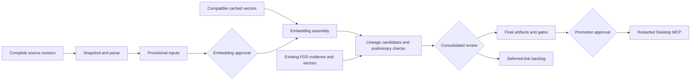

# How recurring code updates work

An identified source revision becomes a reproducible retrieval generation. Source code establishes behavior in the supplied implementation; FDDs establish documented requirements. Differences are reported with both sources. Ingestion alone does not prove which code revision is deployed to Oracle.

## Presentation overview

| Component | Purpose | Retained evidence |
|---|---|---|
| Immutable snapshot | Identify exactly what was supplied | Revision, baseline, source hashes and diff |
| Parser/index preparation | Preserve routines, source locations and dependency observations | Coverage checks, inventories and provisional records |
| Embedding cache | Reuse identical retrieval inputs | Model/input keys and per-path reuse |
| Lineage discovery | Propose code/FDD relationships | Comment regions, vector candidates, excerpts |
| SME review | Confirm findings and test expectations | Consolidated packet and attributable decisions |
| Final evaluation | Test new and retained behavior | Code/combined regressions and bounded MCP UAT |
| Promotion | Select a tested generation coherently | Hash-bound request, approval and configuration receipt |
| Restart verification | Observe the intended server configuration | Challenge-bound live MCP receipt |

## Responsibilities and state

PowerShell forwards operator inputs to a Python coordinator. Existing ingestion, parsing, indexing, retrieval and activation modules remain the engines. Persistent state records completed stages and verifies their outputs on resume. A per-run OS lock prevents simultaneous coordinators; existing Qdrant ownership and MCP mutex rules still apply.

Provisional embedding is explicitly scoped to the new workflow. Normal retrieval and legacy embedding commands still require reviewed artifacts. Provisional lexical diagnostics and semantic suggestions cannot qualify a release. Finalization reconstructs reviewed artifacts after human decisions, reuses vectors and creates final collection payloads with final identities.

Paid work is bound to exact missing inputs, tokenizer/model, cache identities, recorded price and ceiling. An intent is durable before a request; validated vectors are durable afterward. Missing results after a timeout are uncertain and cannot be resent automatically. Local processing failures do not discard completed paid batches.

## Review reuse and deferred lineage

Prior decisions retain reviewer and ledger/mapping provenance. Compatibility checks compare source evidence, policy and connected caller context. Changed or unresolved callers conservatively invalidate affected inheritance. This may request additional review where static analysis cannot establish a safe boundary; it does not claim a complete dynamic call graph.

Accepted relationships enter the reviewed lineage artifact. Deferred candidates remain in the backlog. MCP code results without an accepted relationship retain `no_reviewed_fdd_lineage`, even if another returned FDD has reviewed mappings to different code.

New structural tests are proposed from inventory and reviewed against actual source. Existing regression manifests remain intact. A generated check cannot independently prove semantic correctness of the parser that produced it.

## Timeline and rollout

Automated work runs between embedding authorization, consolidated review and release approval. Additional stops indicate specific exceptions: parse failures, source deletions, uncertain requests, regressions or occupied stores. Run summaries record processing time and gaps between invocations for comparison with historical R3 effort.

Keep R3 active while testing R4. The active promotion supplies the exact regression baseline. Preserve historical runbooks and low-level diagnostic commands. FDD ingestion and future Oracle/Text-to-SQL integration remain separate workflows.

The MCP surface adds read-only `runtime_status(run_id)`, returning generation metadata, process information and a locally signed challenge receipt. It returns no code evidence and performs no external request. The receipt guards against accidental stale verification; filesystem owners are outside its trust boundary.

Configuration application and confirmed restart remain separate states. Existing five-key `.env` promotion and disabled rollback controls are preserved.

After promotion, MCP startup writes a challenge-bound receipt for matching pending runs. `verify` checks its signature, generation, server start and live process creation identity. It does not infer success from `.env` alone. This attests startup of the intended local server, not completion of a fresh ChatGPT search; the staged UAT and subsequent user questions cover retrieval behavior.

## API request policy

The coordinator uses at most 32 excerpts per request and a conservative 8,191-token per-excerpt cap. This stays below the documented 8,192-token input limit and 300,000-token request total. Endpoint disclosure is restricted to `https://api.openai.com/v1`; a custom proxy requires separate reconciliation. The recorded price is operator-confirmed, not hardcoded as a permanent rate. These limits were cross-checked using the [official OpenAI embeddings API reference](https://developers.openai.com/api/reference/python/resources/embeddings/methods/create) on 2026-09-14.
