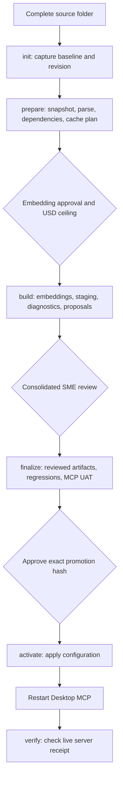

# Recurring code updates

Use `scripts/run_code_update.ps1` for recurring updates above an existing active generation. It records progress in `data/code_updates/<RunId>/`, so reopening PowerShell does not lose paths, snapshot IDs or completed work. Start with `summary.md` or `summary.html` when returning to an old run.

## One-page operating guide



| Action | Human input | Expected stopping point |
|---|---|---|
| `init` | Source directory, actual revision, build, reviewer, confirmed embedding price and source/date | `INITIALIZED` |
| `prepare` | Confirm exact intended deletions if any | `AWAITING_EMBEDDING_APPROVAL` |
| `build` | USD ceiling and displayed `EMBED <hash>` | `AWAITING_SME_REVIEW` |
| `finalize` | Saved review decisions | `READY_FOR_PROMOTION` |
| `activate` | Stopped services and displayed `ACTIVATE <hash>` | `AWAITING_RESTART` |
| `verify` | Restart the intended Desktop MCP first | `COMPLETE` |
| `status` | RunId only | Read-only progress report |

Processing actions generate summaries; status does not write or call a provider. The release approval is separate from the SME review.

## Before starting

- Run from the repository root with the locked project environment (`uv sync --locked`). The tokenizer may download its public encoding table on first use; token counting does not call the embedding API.
- Supply the **complete intended source tree**, retaining baseline relative paths. A missing baseline source is a deletion.
- Existing extension policy includes `.sql`, `.spc`, `.prc`, `.fnc`. External source files are copied read-only.
- `init` identifies the baseline through active configuration and an exact applied promotion request/receipt. It needs the corresponding embedded artifact, dependency ledger, reviewed lineage and passed code/combined reports. Ambiguity fails before import or spending.
- For a project's first-ever corpus without promotion evidence, establish its baseline using the original generation runbook. This coordinator is for updates to that baseline.

`RunId` is an operator label such as `R4` or `SeptemberFixes`. The actual SVN revision is separate and forms the existing `<module>-r<revision>-<hash>` snapshot identity. Do not invent revisions as retry counters.

## Worked R4 sequence

Assemble all 20 retained R3 files plus approximately 30 additions in a source folder. Preserve `functional_specs_v9` as the selected FDD baseline. No package categories or expected FDD titles are required before discovery.

### 1. Initialize once

```powershell
.\scripts\run_code_update.ps1 -Action init -RunId R4
```

Answer the source path, actual revision, build, reviewer, USD price per million embedding input tokens, and pricing reference/date prompts. Optional parameters are `-SourceDirectory`, `-SvnRevision`, `-ApplicationBuild`, `-Reviewer`, `-PricePerMillion`, `-PricingBasis` and `-EnhancementRegistry`. Without a registry, discovery uses stored vectors and source comments with no predeclared correspondences.

Inspect `data/code_updates/R4/config.json`. The coordinator also creates the request directory and JSON **file**. Do not edit these bound inputs after initialization; use a new RunId for corrected inputs.

### 2. Prepare locally

```powershell
.\scripts\run_code_update.ps1 -Action prepare -RunId R4
```

This imports the source, identifies the exact immutable snapshot, parses and checks declaration coverage, prepares dependency proposals and verifies a provisional index. Then it checks the compatible base embedding cache.

`embedding_request.json` records the model, tokenizer version, exact input keys, source paths, counted tokens, cache hashes, pricing basis, estimate and request hash. The retained field `token_upper_bound` contains the `cl100k_base` input count used for budget accounting. Unchanged baseline files must have no cache misses. If nothing changed, the run stops at `NO_SOURCE_CHANGES` without spending or promotion.

### 3. Approve embedding and build

```powershell
.\scripts\run_code_update.ps1 -Action build -RunId R4
```

Enter the maximum authorized USD amount and the displayed `EMBED <hash>`. This authorizes sending the frozen missing code excerpts using `text-embedding-3-large`. Automatic paid retries are disabled. A batch intent is saved before sending; validated vectors are saved after every successful response.

Committed input cost is checked before every batch using the recorded rate. This limits requests from this workflow, not other account activity or provider billing adjustments. Prices are operator-confirmed; the workflow does not infer spending limits from prepaid balance.

After embedding, it stages a provisional collection, runs preliminary lexical diagnostics, discovers lineage candidates and creates `review.md` with a read-only `review.html` companion. If the embedded store is occupied, stop its owning process and repeat the same command. Do not delete store lock files.

### 4. Review the consolidated packet

Open `data/code_updates/R4/review.md`. Compare proposed findings against the attached source/FDD evidence. Existing regression diagnostics are linked from the run summary.

Edit only these fields:

```text
Decision: accepted
Rationale: Explain what you checked in the cited source and why the finding holds.
Correction JSON: {}
```

| Decision | Meaning |
|---|---|
| `accepted` | Confirm the proposed finding with a rationale |
| `corrected` | Supply a correction object and rationale |
| `deferred` | New lineage candidate only; exclude it from reviewed mappings |
| `needs_more_context` / `pending` | Unresolved item; finalization identifies the blocker |
| `carried` | Read-only reuse of a compatible prior decision with original provenance |

Dependency corrections use `dependency_kind` and `resolution_state`. Evaluation corrections use fields in the displayed case. Lineage corrections allow `targets`, `fdd_document_id`, `fdd_release_label`, and `evaluation_question`. Keep evidence JSON, IDs and the packet hash unchanged. Corrected targets must exist in the snapshot.

Changed existing lineage needs resolution; new uncertain relationships may be deferred. Carry-forward is conservative around modified or unresolved callers. Generated test expectations need independent source review: passing a parser-derived check alone does not establish semantic correctness.

### 5. Finalize and test

```powershell
.\scripts\run_code_update.ps1 -Action finalize -RunId R4
```

This imports review decisions, creates final reviewed artifacts, reuses compatible vectors, stages final payloads in a fresh collection and runs existing plus new reviewed evaluations and documentation-boundary checks. Then it runs at most five local lexical MCP searches, fetching only returned IDs. These cover inventory, caller context, table behavior, reviewed lineage and an unmapped-code boundary where the corpus contains those cases. These checks do not substitute for broader user acceptance questions.

The temporary stdio test child requires released local stores and the existing MCP launcher mutex. Stop FastAPI/Desktop MCP when asked by an ownership error; the coordinator does not kill them.

Metadata-only review corrections need no new embeddings. If embedding text changes, the workflow returns to `AWAITING_EMBEDDING_APPROVAL`: repeat `build` to approve only the additional inputs, then `finalize`. Earlier vectors and approvals remain preserved. Edited review decisions produce a new finalization revision. Final reports bind final identities; provisional results cannot qualify for promotion.

### 6. Promote

```powershell
.\scripts\run_code_update.ps1 -Action activate -RunId R4 -ServicesStopped
```

After stopping services, approve `ACTIVATE <promotion-hash>`. The existing atomic five-key `.env` switch selects the final artifact, analysis, collection and lineage, with code modes enabled. Review decisions, reuse evidence, final tests and MCP UAT are bound to promotion. No service starts automatically.

Let Desktop MCP inherit these five settings from `.env`; remove conflicting Desktop overrides. Disclosure and retrieval strategy remain separate choices. Reload any stale editor buffer before saving `.env`.

### 7. Verify the restarted Desktop MCP

Restart the intended Desktop MCP, then run:

```powershell
.\scripts\run_code_update.ps1 -Action verify -RunId R4
```

The server records a signed startup receipt only for an already-promoted run waiting for that generation. Verification checks the process is still running, including its creation identity to reject reused PIDs. This is a startup/process attestation, not a new retrieval query. The staged MCP UAT supplies the retrieval-test evidence.

If a receipt could not be written, the diagnostic fallback is to ask ChatGPT:

```text
Call the culling-blade MCP runtime_status tool with run_id R4.
Return its JSON receipt unchanged. Do not start another client or run a search.
```

Save the JSON object, without code fences, to `data/code_updates/R4/desktop_receipt.json`:

```powershell
.\scripts\run_code_update.ps1 -Action verify -RunId R4 -RuntimeReceipt data\code_updates\R4\desktop_receipt.json
```

The receipt verifies a post-promotion server start, live process identity, generation identities and a per-run challenge. It is local laptop evidence, not authentication against a person controlling the filesystem. This check makes no paid request and returns no code excerpts.

## Recovery and history

| Situation | Recovery |
|---|---|
| Closed terminal | Run `status` with the same RunId, then repeat the pending action |
| Embedding succeeded; indexing failed | Repeat `build`; verified saved vectors are reused |
| Timeout/quota/lost response | The batch remains uncertain. Reconcile provider records; do not delete its intent or resend blindly |
| Budget too small | Repeat `build -MaxUsd <new-total-ceiling>`; confirm the displayed hash. A versioned approval is recorded, and prior committed batch costs still count |
| Existing partial collection | It is retained; a fresh collection attempt is recorded |
| Store occupied | Stop its owning process and repeat the action |
| Wrong source/revision | Start a new RunId with corrected inputs; preserve the old run |
| Failed parser attempt | Correct the parser cause, then repeat `prepare`; failed outputs are preserved in a separate attempt. A successful bound parse is never overwritten |
| Parser/policy change after successful preparation | Start a fresh run with compatible parse inputs; never relabel old approvals |
| Review correction | Edit decision fields and repeat `finalize` |
| Failed regression | Inspect the report and fix the cause, then repeat `finalize`. Failed attempts remain intact; a runtime change gets fresh code/combined/MCP reports |
| Changed bound output | Reconcile the identified evidence; resume will not trust directory order |

Rollback uses the existing `scripts/promote_code_generation.py switch --action rollback` command with the request and approval paths shown by `status`. Dry-run first, then use `--apply --services-stopped`. It restores the previous selection with code modes disabled; restart and verify that disabled state. Retain every receipt.

For a historical explanation, read `summary.md` / `summary.html`, then follow their artifact links. `config.json` identifies inputs, `events.jsonl` records transitions, `batches/` explains paid work, and `final/<review-hash>/decisions.json` records review outcomes. `deferred_lineage.json` is the follow-up backlog. Promotion/restart receipts identify what was selected and observed.

Processing time, time spent at prompts, prompt count and gaps between invocations are recorded separately. Gaps include operator absence and must not be interpreted as pure SME effort.

## R4 rollout checklist

The commands above are implemented. Local automated tests use synthetic source and fake embedding responses; they do **not** certify the real R4 corpus or Desktop connection. Keep R3 active during the trial. Record the actual source directory, SVN revision and build at `init`; approve paid work only after inspecting `prepare` output. Compare the final reviewed R4 checks and retained R2/R3 regressions, then complete staged MCP UAT, promotion approval and Desktop restart verification. Inspect processing time, waiting time, prompt count and preserved failures in the summary before calling the rollout accepted.
