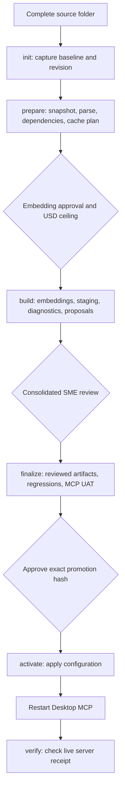

# Recurring code updates

Use `scripts/run_code_update.ps1` for recurring updates above an existing active generation. It records progress in `data/code_updates/<RunId>/`, so reopening PowerShell does not lose paths, snapshot IDs or completed work. Start with `summary.md` or `summary.html` when returning to an old run.

## One-page operating guide



| Action | Human input | Expected stopping point |
|---|---|---|
| `init` | Source directory, actual revision, build, reviewer, confirmed embedding price and source/date | `INITIALIZED` |
| `prepare` | Confirm exact intended deletions if any | `AWAITING_EMBEDDING_APPROVAL` |
| `build` | USD ceiling and displayed `EMBED <hash>` | `AWAITING_SME_REVIEW` |
| `amend-review` | Creates one regression-discovered lineage candidate for an additional SME decision | Existing review remains intact; then `finalize` |
| `finalize` | Saved review decisions | `READY_FOR_PROMOTION` |
| `activate` | Stopped services and displayed `ACTIVATE <hash>` | `AWAITING_RESTART` |
| `verify` | Restart the intended Desktop MCP first | `COMPLETE` |
| `status` | RunId only | Read-only progress report |

Processing actions generate summaries; status does not write or call a provider. The release approval is separate from the SME review.

## Before starting

- Run from the repository root with the locked project environment (`uv sync --locked`). The tokenizer may download its public encoding table on first use; token counting does not call the embedding API.
- Supply the **complete intended source tree**, retaining baseline relative paths. A missing baseline source is a deletion.
- Do not manually create `data/raw_code/<request>` or `snapshot_request.json` for this coordinator. It owns its intake under `data/code_updates/<RunId>/intake`.
- Keep a completed run's review, evidence, source, and final artifacts unchanged. Next-run initialization verifies the previous promotion's evidence hashes, including its review Markdown. Save later decisions in a separate pending file for a future review.
- Existing extension policy includes `.sql`, `.spc`, `.prc`, `.fnc`. External source files are copied read-only.
- `init` identifies the baseline through active configuration and an exact applied promotion request/receipt. It needs the corresponding embedded artifact, dependency ledger, reviewed lineage and passed code/combined reports. Ambiguity fails before import or spending.
- For a project's first-ever corpus without promotion evidence, establish its baseline using the original generation runbook. This coordinator is for updates to that baseline.

`RunId` is an operator label such as `Release_005` or `SeptemberFixes`. This guide uses `Release_005` for the new update; use that same label for every action and when resuming. The actual SVN revision is separate and forms the existing `<module>-r<revision>-<hash>` snapshot identity. Do not infer revision `4` from the run label or invent revisions as retry counters. Historical `R4-pricefix` evidence keeps its original name.

## Worked Release_005 sequence

Assemble the complete intended source folder, retaining the 59 files from the active R4 baseline except deliberate removals, and include genuine revisions and additions. Preserve `functional_specs_v9` as the selected FDD baseline. No package categories or expected FDD titles are required before discovery.

### 1. Initialize once

```powershell
.\scripts\run_code_update.ps1 -Action init -RunId Release_005
```

Answer the source path, actual revision, build, reviewer, USD price per million embedding input tokens, and pricing reference/date prompts. Optional parameters are `-SourceDirectory`, `-SvnRevision`, `-ApplicationBuild`, `-Reviewer`, `-PricePerMillion`, `-PricingBasis` and `-EnhancementRegistry`. Without a registry, discovery uses stored vectors and source comments with no predeclared correspondences.

Inspect `data/code_updates/Release_005/config.json`. The coordinator also creates the request directory and JSON **file**. Do not edit these bound inputs after initialization; use a new RunId for corrected inputs.

### 2. Prepare locally

```powershell
.\scripts\run_code_update.ps1 -Action prepare -RunId Release_005
```

This imports the source, identifies the exact immutable snapshot, parses and checks declaration coverage, prepares dependency proposals and verifies a provisional index. Then it checks the compatible base embedding cache.

Unchanged files reuse the active baseline's compatible parse results after source hashes, compiler context, parser generation, policy and resource settings are checked. Retrieval IDs are regenerated for the new snapshot and dependency analysis is rebuilt across the complete source set. This prevents a machine-load-dependent full-parser timeout from changing embedding inputs for identical source. New or modified files are parsed normally.

If an older unfinished run already parsed unchanged files again, `prepare` can publish a separate `parse_baseline_reuse` stage using the baseline for unchanged files and the existing attempt for other files. It retains the original parse and preserves superseded, unapproved preparation artifacts under `failed_preparation/`. Successful embedding approvals and checkpoints are never overwritten by this recovery.

`embedding_request.json` records the model, tokenizer version, exact input keys, source paths, counted tokens, cache hashes, pricing basis, estimate and request hash. The retained field `token_upper_bound` contains the `cl100k_base` input count used for budget accounting. Unchanged baseline files must have no cache misses. If nothing changed, the run stops at `NO_SOURCE_CHANGES` without spending or promotion.

### 3. Approve embedding and build

```powershell
.\scripts\run_code_update.ps1 -Action build -RunId Release_005
```

Enter the maximum authorized USD amount and the displayed `EMBED <hash>`. This authorizes sending the frozen missing code excerpts using `text-embedding-3-large`. Automatic paid retries are disabled. A batch intent is saved before sending; validated vectors are saved after every successful response.

Committed input cost is checked before every batch using the recorded rate. This limits requests from this workflow, not other account activity or provider billing adjustments. Prices are operator-confirmed; the workflow does not infer spending limits from prepaid balance.

After embedding, it stages a provisional collection, runs preliminary lexical diagnostics, discovers lineage candidates and creates `review.md` with a read-only `review.html` companion. If the embedded store is occupied, stop its owning process and repeat the same command. Do not delete store lock files.

### 4. Review the consolidated packet

Open `data/code_updates/Release_005/review.md`. Compare proposed findings against the attached source/FDD evidence. Existing regression diagnostics are linked from the run summary.

Edit only these fields:

```text
Decision: accepted
Rationale: Explain what you checked in the cited source and why the finding holds.
Correction JSON: {}
```

| Decision | Meaning |
|---|---|
| `accepted` | Confirm the proposed finding with a rationale |
| `corrected` | Supply a correction object and rationale |
| `deferred` | New lineage candidate only; exclude it from reviewed mappings |
| `needs_more_context` / `pending` | Unresolved item; finalization identifies the blocker |
| `carried` | Read-only reuse of a compatible prior decision with original provenance |

Dependency corrections use `dependency_kind` and `resolution_state`. Evaluation corrections use fields in the displayed case. Lineage corrections allow `targets`, `fdd_document_id`, `fdd_release_label`, and `evaluation_question`. Keep evidence JSON, IDs and the packet hash unchanged. Corrected targets must exist in the snapshot.

Accepted/corrected lineage rationales require at least 10 characters; `accepted` alone is insufficient. State the supporting routine and business behavior. Review items are parsed within their individual `## <item-id>` sections. Do not use a regular expression that can cross section boundaries to count or bulk-edit verdicts. Use the workflow's decision parser when automating review operations. The HTML is the generated preview; the Markdown decisions are authoritative.

An evaluation question containing only a package/routine identifier can retrieve code while missing FDD terminology. A meaningful business-language question can be added or corrected through SME review. This does not demonstrate that the original identifier-only query was fixed: retain that limitation in testing, and investigate retrieval if that query is a required user scenario. Do not rewrite an established regression merely to make it pass.

For an exact package-qualified routine with one unambiguous reviewed document link,
combined retrieval can now retrieve a passage from that FDD even when it missed the
global candidate list. This reserves one existing result slot; it does not create
lineage, use file-wide mappings, or approve the selected passage independently.
The routine's source path and overload must resolve against the bound analysis.
Lexical evaluation uses the same FDD document context as runtime retrieval.

If finalization reports a failed regression, read the named case ID and missing
evidence in the error and its JSON report. A missing FDD result does **not** by
itself mean another SME review is needed: first check whether the final reviewed
lineage already contains the exact relationship. Fix retrieval when the accepted
link exists; request SME review only when the relationship or expectation needs
a new or corrected decision. After a code fix, rerun `finalize` for the same run;
do not rerun embeddings or edit accepted expectations simply to pass.

Changed existing lineage needs resolution; new uncertain relationships may be deferred. Carry-forward is conservative around modified or unresolved callers. Generated test expectations need independent source review: passing a parser-derived check alone does not establish semantic correctness.

### Regression-discovered lineage amendment

Normally all SME decisions are made in the consolidated packet. If a final
regression identifies one exact routine/FDD relationship that was not included
there, preserve the original packet and create a separate, single-item
amendment rather than rewriting history:

```powershell
.\scripts\run_code_update.ps1 -Action amend-review -RunId Release_005 `
  -FddDocumentId '<exact-fdd-document-id>' `
  -SourcePath 'SQL\package_body.sql' `
  -QualifiedName 'PACKAGE_BODY.ROUTINE_NAME' `
  -SymbolKind procedure `
  -SourceMarker '<exact FDD marker from immutable source comments>' `
  -EvidenceQuery '<business requirement terms to locate the FDD passage>'
```

`-EvidenceQuery` is required and is reused in the proposed evaluation question.
Use terms describing this requirement (for example, a payment validation or
claim reversal); there is no default AML/FlagRight query. An amendment is
available only before activation and currently supports one additional packet
per run.

The target must be an exact parsed symbol, the source marker must be in the
immutable snapshot, and the FDD must exist in the configured FDD generation.
The action creates `review_amendment.md` and a read-only HTML companion in the
same run directory. It does not alter the original `review.md`, send embeddings
or change a collection.

Review only the new item. Accept it only when the cited code and FDD passage
support the relationship; otherwise defer it. A finalized generation binds both
review packet hashes, so the original decisions and the amendment remain
independently auditable.

### 5. Finalize and test

```powershell
.\scripts\run_code_update.ps1 -Action finalize -RunId Release_005
```

This imports review decisions, creates final reviewed artifacts, reuses compatible vectors, stages final payloads in a fresh collection and runs existing plus new reviewed evaluations and documentation-boundary checks. Then it runs at most five local lexical MCP searches, fetching only returned IDs. These cover inventory, caller context, table behavior, reviewed lineage and an unmapped-code boundary where the corpus contains those cases. These checks do not substitute for broader user acceptance questions.

The temporary stdio test child requires released local stores and the existing MCP launcher mutex. Stop FastAPI/Desktop MCP when asked by an ownership error; the coordinator does not kill them.

Metadata-only review corrections need no new embeddings. If embedding text changes, the workflow returns to `AWAITING_EMBEDDING_APPROVAL`: repeat `build` to approve only the additional inputs, then `finalize`. Earlier vectors and approvals remain preserved. Edited review decisions produce a new finalization revision. Final reports bind final identities; provisional results cannot qualify for promotion.

Final evaluation uses the same per-case checks as promotion. A report with an overall passing rate but individual failures stops here and remains an attempt report; it is not saved as a successful checkpoint. Inspect the named attempt and log, fix the cause, and resume.

### 6. Promote

```powershell
.\scripts\run_code_update.ps1 -Action activate -RunId Release_005 -ServicesStopped
```

After stopping services, approve `ACTIVATE <promotion-hash>`. The existing atomic five-key `.env` switch selects the final artifact, analysis, collection and lineage, with code modes enabled. Review decisions, reuse evidence, final tests and MCP UAT are bound to promotion. No service starts automatically.

Let Desktop MCP inherit these five settings from `.env`; remove conflicting Desktop overrides. Disclosure and retrieval strategy remain separate choices. Reload any stale editor buffer before saving `.env`.

If any bound Python, PowerShell, configuration, or dependency file changes after finalization, run `finalize` again **before** activation. It reuses compatible artifacts/vectors, reruns final gates for the current runtime and emits a new promotion hash. Approve that new hash. An earlier hash cannot authorize the changed runtime.

### 7. Verify the restarted Desktop MCP

Restart the intended Desktop MCP, then run:

```powershell
.\scripts\run_code_update.ps1 -Action verify -RunId Release_005
```

The server records a signed startup receipt only for an already-promoted run waiting for that generation. Verification checks the process is still running, including its creation identity to reject reused PIDs. This is a startup/process attestation, not a new retrieval query. The staged MCP UAT supplies the retrieval-test evidence.

If a receipt could not be written, the diagnostic fallback is to ask ChatGPT:

```text
Call the culling-blade MCP runtime_status tool with run_id Release_005.
Return its JSON receipt unchanged. Do not start another client or run a search.
```

Save the JSON object, without code fences, to `data/code_updates/Release_005/desktop_receipt.json`:

```powershell
.\scripts\run_code_update.ps1 -Action verify -RunId Release_005 -RuntimeReceipt data\code_updates\Release_005\desktop_receipt.json
```

The receipt verifies a post-promotion server start, live process identity, generation identities and a per-run challenge. It is local laptop evidence, not authentication against a person controlling the filesystem. This check makes no paid request and returns no code excerpts.

## Recovery and history

| Situation | Recovery |
|---|---|
| Closed terminal | Run `status` with the same RunId, then repeat the pending action |
| Embedding succeeded; indexing failed | Repeat `build`; verified saved vectors are reused |
| `Unexpected embedding miss in unchanged source` | Repeat `prepare` with the current coordinator to apply compatible baseline parse reuse. If it still stops, inspect source/parse contract differences; never bypass the cache guard or force paid re-embedding of unchanged files |
| Timeout/quota/lost response | The batch remains uncertain. Reconcile provider records; do not delete its intent or resend blindly |
| Budget too small | Repeat `build -MaxUsd <new-total-ceiling>`; confirm the displayed hash. A versioned approval is recorded, and prior committed batch costs still count |
| Existing partial collection | It is retained; a fresh collection attempt is recorded |
| Store occupied | Stop its owning process and repeat the action |
| Wrong source/revision | Start a new RunId with corrected inputs; preserve the old run |
| Failed parser attempt | Correct the parser cause, then repeat `prepare`; failed outputs are preserved in a separate attempt. A successful bound parse is never overwritten |
| Parser/policy change after successful preparation | Start a fresh run with compatible parse inputs; never relabel old approvals |
| Review correction before activation | Edit decision fields and repeat `finalize` |
| Later review decisions after activation | Preserve them separately for a future run. Do not edit the promoted review or rerun finalization on the completed run |
| Missing exact lineage exposed by a regression | Create and review one `amend-review` packet, then repeat `finalize`; the original review remains immutable |
| Failed regression | Inspect the report and fix the cause, then repeat `finalize`. Failed attempts remain intact; a runtime change gets fresh code/combined/MCP reports |
| Changed bound output | Reconcile the identified evidence; resume will not trust directory order |
| `Runtime changed; prepare a new request and approval` | Repeat `finalize`, then approve its fresh hash during `activate`; successful embedding batches are reused |
| `Review changed after finalization` | Compare both primary and amendment packets with final decisions. Before activation, finalize actual edits again; after activation, use a future run |
| Directory membership error | Ordering differences are tolerated. Check genuine file additions/removals and access failures; do not create endless retry runs for a permissions problem |
| `Unknown code path` after a directory move | A unique filename can rebind an accepted proposal and is recorded in `decisions.json`. Duplicate filenames stop. Explicit corrected target paths must match exactly |
| TaskGroup/transport error during MCP UAT | Read the named `logs/mcp-uat-*.stderr.log` and leaf exception. Check store ownership and the execution account's access to the exact path; then resume `finalize` |
| MCP UAT missing bounded caller context | Read the query, missing caller path, and `logs/mcp-uat-*.stderr.searches.json` diagnostic. This is a retrieval assertion, not necessarily a transport failure. Package-qualified routine names and explicit source paths disambiguate repeated hook names; genuinely ambiguous overloads still stop discovery. Fix the cause, then repeat `finalize`; do not remove the expected caller or repeat embeddings |

Rollback uses the existing `scripts/promote_code_generation.py switch --action rollback` command with the request and approval paths shown by `status`. Dry-run first, then use `--apply --services-stopped`. It restores the previous selection with code modes disabled; restart and verify that disabled state. Retain every receipt.

For a historical explanation, read `summary.md` / `summary.html`, then follow their artifact links. `config.json` identifies inputs, `events.jsonl` records transitions, `batches/` explains paid work, and `final/<review-hash>/decisions.json` records review outcomes. `deferred_lineage.json` is the follow-up backlog. Promotion/restart receipts identify what was selected and observed.

Processing time, time spent at prompts, prompt count and gaps between invocations are recorded separately. Gaps include operator absence and must not be interpreted as pure SME effort.

## R4 lessons and R5 readiness (15 September 2026)

R4-pricefix completed activation and restart verification on snapshot
`fci-custom-r4-5e71d3bc92e1`, using FDD `functional_specs_v9`. Its final gates
covered 60 code cases, 19 combined cases, the documentation boundary and bounded
local MCP UAT. These results describe that corpus and runtime, not an automatic
pass for the next source revision.

| R4 obstacle | Recurring behavior / remaining limit |
|---|---|
| Different Windows directory ordering | Binding and rebinding compare membership independently of enumeration order; file hashes still matter |
| Moved SQL/SPC folders | Exact content renames can reuse vectors; unique filename target rebinding is recorded. Ambiguity stops and moved/changed caller context can still require review |
| Short lineage rationale | Review parser identifies the item before artifact construction |
| Similar routine names | Explicit returned routine names guide bounded reviewed FDD selection. The FDD must still be retrievable within candidate limits |
| Unrelated FDD mapping in a boundary response | The boundary checks overlap with the requested source's evidence; a reviewed link to that source still fails the boundary |
| Desktop process already owns the store | Ownership check stops the local test child; operator releases the owning process |
| Hidden TaskGroup exception | Leaf error and a unique server stderr log identify the failure |
| Amendment review hash mismatch | Finalization, additional-input resume and activation use both packet identities |
| Overall evaluation passes but a case fails | Final checkpoint requires promotion's strict per-case validation |
| Next baseline contains a boundary report | Initialization imports its separate boundary contract without treating it as a code/combined score report |
| Permissions on newly created data | Environment-dependent; no automatic ACL repair is performed by the workflow |

### Permissions before a new run

Use the same intended Windows account for running the workflow and restarting
Desktop MCP. An assistant sandbox may use a different account. When it reports
access denied, inspect permissions on the exact failing path and its parents:

```powershell
whoami
icacls data\code_snapshots
icacls data\code_updates
```

Read/execute on source and analysis allows inspection; the coordinator also
needs write access to its run outputs and store, and MCP needs access to its
startup receipt location. A scoped RX repair on an old snapshot does not prove
new snapshots are readable. Inheritance depends on the actual ACLs, protected
children, creation/copy behavior and execution identity. Have the owner/admin
verify those conditions before granting access. Do not reset ACLs, change
ownership or recursively grant access as a routine retry step. Permission
repairs do not require embeddings to be regenerated.

### R4 post-activation review correction

The later bulk lineage approvals were originally written into the already
promoted `R4-pricefix/review.md`. That would invalidate the baseline evidence
for R5. During the audit the exact promoted copy was restored from its
hash-verified backup, and the later approvals were preserved at:

`data/code_updates/R4-pricefix/review.post-activation-lineage-acceptance.pending.md`

The current R4 runtime retains its promoted decisions (159 deferred candidate
relationships). The pending file preserves the later acceptance intent; it is
not automatically imported as approved R5 lineage. Reconcile those candidates
against R5 evidence in its new review packet. Unchanged-source runs currently
stop at `NO_SOURCE_CHANGES`; there is no separate review-only promotion action.

### Starting the next update: Release_005

1. Prepare the complete intended tree: retain the 59 R4 files except deliberate
   removals, include real revised files and additions, and preserve SQL/SPC
   relative paths where possible. Use the actual SVN revision.
2. Run the following commands one at a time at their checkpoints. `Release_005` initialization
   captures the configured applied R4 baseline; do not supply an old R3 ID or
   manually create request folders.

```powershell
.\scripts\run_code_update.ps1 -Action init -RunId Release_005
.\scripts\run_code_update.ps1 -Action prepare -RunId Release_005
# Inspect cache misses and approve the displayed embedding request/ceiling.
.\scripts\run_code_update.ps1 -Action build -RunId Release_005
# Review data/code_updates/Release_005/review.md, then release Desktop/FastAPI stores.
.\scripts\run_code_update.ps1 -Action finalize -RunId Release_005
# Approve only the fresh promotion hash after successful final gates.
.\scripts\run_code_update.ps1 -Action activate -RunId Release_005 -ServicesStopped
# Restart Desktop MCP before verification.
.\scripts\run_code_update.ps1 -Action verify -RunId Release_005
.\scripts\run_code_update.ps1 -Action status -RunId Release_005
```

Do not paste the sequence as an unattended batch: embedding, review, promotion
and restart are separate checkpoints. A `DELETE <hash>` prompt refers to the
intended snapshot delta; inspect moves and modified files before confirming.
Parsing/discovery may take time on large packages. Check the same run's logs
and status instead of launching a second coordinator.

`COMPLETE` records successful restart verification. `status` displays recorded
state and does not revalidate live retrieval or changed evidence. Preserve all
promoted files for future baseline checks. The automated regression tests cover
generic recovery behavior, but new parser constructs, retrieval failures and
environment permissions can still require investigation on the new run.

## Coordinated FDD/code releases

For a release that changes FDDs, code, or their lineage together, use
[Knowledge_Update_Runbook.md](Knowledge_Update_Runbook.md). It keeps FDD and
code settings compatible at promotion time. This runbook remains the supported
historical and low-level path for code-only diagnostics and existing runs.
